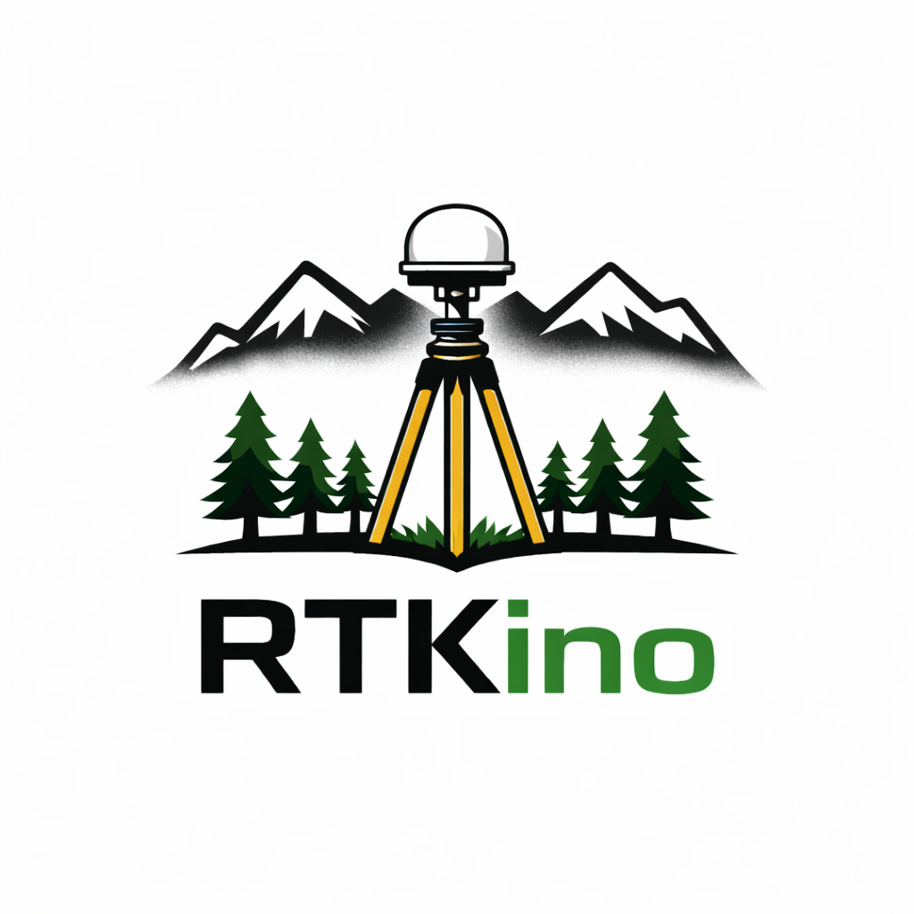

# RTKino — Open-Source RTK GNSS Firmware for ESP32-S3

<p align="center">
  
</p>

**RTKino** is an open-source firmware that turns an ESP32-S3 and a u-blox ZED-F9P into a full-featured RTK GNSS rover and base station, with a modern web interface and standalone OLED operation. 
Designed and tested — sometimes with pain and frustration — in real-world conditions, not in the lab.

[](LICENSE)
[](https://www.espressif.com/)
[](https://www.u-blox.com/)
[](ETHICAL_USE.md)

> **Important:** Please read the [Disclaimer](DISCLAIMER.md) and [Ethical Use Notice](ETHICAL_USE.md) before using this software.

## Note on Development

RTKino was built from real-world surveying needs, not from a software-first approach.

It has been shaped through practical use in the field, with AI-assisted tools used to support development and speed up implementation.

The focus of this project is function, reliability, and real usability.

---

## Features

### Rover Mode — Receive RTK Corrections

- **NTRIP Client** with automatic GGA forwarding (5-second interval) for VRS services
- **TCP Input** for local LAN base stations or LoRa radio links
- **Multi-profile management** with quick switching between correction sources
- **Real-time RTK status** with audible buzzer alerts on fix state changes
- **RTCM statistics** showing message types, counts, CRC errors, and data freshness
- **Tested with professional NTRIP services**: HxGN SmartNet, TPOS, SPIN-GNSS, Pegaso VRS

### Base Station Mode — Transmit Corrections

- **Fixed position mode** with manual LLH coordinate entry
- **Survey mode** with configurable averaging (30–300 seconds)
- **Saved base stations** with names, coordinates, and antenna parameters
- **Professional antenna height correction**: ground point → ARP → phase center (see [Antenna Survey](docs/ANTENNA_SURVEY.md))
- **NTRIP Server** (pusher) to external casters
- **TCP Server** on configurable local port
- **TCP Client** to external TCP endpoints
- **MSM7 (4 constellations)** or **MSM4 (3 constellations)** RTCM output
- **One-click switch** between Base and Rover modes

### Survey & Measurement

RTKino includes a complete point survey system.

- **Timed measurements** with configurable duration and sampling interval
- **Quality gate** with thresholds for horizontal accuracy, PDOP, and satellite count
- **Full GNSS snapshot** per point:
  - NAV-HPPOSLLH (high-precision geodetic coordinates)
  - NAV-HPPOSECEF (high-precision cartesian coordinates)
  - NAV-DOP (all 7 DOP values: GDOP, PDOP, HDOP, VDOP, NDOP, EDOP, TDOP)
  - NAV-COV (position covariance matrix: NN, EE, DD, NE, ND, ED)
  - NAV-RELPOSNED (baseline components and standard deviations)
- **Point codes** with customizable categories (editable via web UI)
- **Survey management** with create, list, activate, export, and delete operations
- **GeoJSON and CSV export** of survey data

### Point Codes

RTKino ships with a default set of **Italian point codes** designed for compatibility with widely used Italian surveying software.  
These codes should enable seamless CAD export with automatic blocks and symbology.

The point code list is **fully editable** from the WebUI: go to **Settings → Point Codes**, modify the JSON as needed, and hit **Save**. Use **Reset** to restore the Italian defaults at any time.

> **Generic English codes available:** if you prefer an English code set, copy the contents of [`docs/point_codes_EN.json`](docs/point_codes_EN.json) and paste them into the Point Codes editor. 

### Stakeout (Setting Out)

Navigate to design points with real-time guidance on the OLED display or web interface.

- **Import target points** from CSV, GeoJSON, or directly from RTKino surveys
- **Live navigation** showing 2D distance, height difference, and azimuth
- **Point list management** with file-based organization

### Data Logging

Log raw GNSS observations for post-processing kinematic (PPK) workflows.

- **Raw UBX logging** to SD card at configurable rates (1–15 Hz)
- **NTP or GNSS-synced timestamps** for automatic file naming
- **Hardware switch** (GPIO) for hands-free logging control
- **Periodic flush** to prevent data loss on power failure

### Connectivity

- **Multi-WiFi** with priority-based network selection
- **Access Point mode** for offline configuration (192.168.4.1)
- **BLE (Bluetooth Low Energy)** via Nordic UART Service — compatible with SW Maps, GNSS Master, and Lefebure NTRIP Client
- **BLE pairing** with 6-digit PIN and encrypted connection
- **mDNS** for easy access via `http://rtkino.local/`
- **TCP viewer** streaming NMEA/UBX on port 1234
- **OTA firmware update** via web browser
- **Configuration backup/restore** as JSON

### Dual Interface

**Web UI** — Full-featured responsive dashboard accessible from any browser (smartphone, tablet, laptop). Real-time position display, NTRIP/TCP configuration, base station setup, survey management, stakeout navigation, settings, system logs, and configuration backup/restore.

**OLED + Rotary Encoder** — For standalone fieldwork without a phone. Navigate menus, select survey codes, take measurements, browse stakeout points, toggle connections, and monitor RTK status — all from a 128×64 pixel display and a single rotary knob.

---

## Hardware

### Minimum Requirements

| Component | Specification |
|-----------|---------------|
| **MCU** | ESP32-S3 with 16 MB Flash and 8 MB PSRAM |
| **GNSS** | u-blox ZED-F9P with UART and I2C exposed - current firmware is 1.51 |
| **Storage** | MicroSD card (FAT32) |

### Optional

| Component | Purpose |
|-----------|---------|
| **Display** | SSD1306 128×64 OLED (I2C) |
| **Buzzer** | Passive buzzer on GPIO 5 for RTK state alerts |
| **Rotary Encoder** | CLK/DT/SW for OLED menu navigation |

### Tested Boards

- **Lolin S3 Pro** (recommended — integrated SD slot, native I2C connector)
- Any ESP32-S3 board with 16 MB Flash and 8 MB PSRAM

### Tested GNSS Modules

- Ardusimple simpleRTK2Bpro
- SparkFun GPS-RTK-SMA
- Any ZED-F9P breakout with UART2 + I2C access

### Wiring

```
ESP32-S3 GPIO          ZED-F9P
─────────────          ───────
GPIO 40 (RX)  ◄─────  UART2 TX   (NMEA/UBX/RTCM output)
GPIO 39 (TX)  ─────►  UART2 RX   (RTCM input for rover)
GPIO 42 (RX)  ◄─────  UART1 TX   (RAW data for logging)

GPIO 9  (SDA) ◄────►  I2C SDA    (configuration via VALSET/VALGET)
GPIO 10 (SCL) ◄────►  I2C SCL

GPIO 17       ◄─────  Log Switch  (active LOW, internal pullup)
GPIO 5        ─────►  Buzzer      (PWM output)
```

Pin assignments are defined in `include/config.h` and can be adapted to other ESP32-S3 boards by adding a new board definition.

---

## Installation

### Pre-built firmware (recommended)

Every tagged release is automatically built by GitHub Actions and published with everything you need to flash — no development tools required.

**Option 1 — Web Flasher (zero install)**

The easiest method. Works directly from a Chromium-based browser (Chrome, Edge, Brave).

1. Connect the ESP32-S3 via USB
2. Open the **[RTKino Web Flasher](https://flyingsurveyor.github.io/RTKINO/)**
3. Click **"Install RTKino"** and select the serial port
4. Done in ~60 seconds

**Option 2 — Release ZIP (Windows / macOS / Linux)**

1. Download the latest `rtkino-vX.X.X-lolin_s3_pro.zip` from [Releases](https://github.com/flyingsurveyor/RTKINO/releases)
2. Extract the folder
3. Connect the ESP32-S3 via USB
4. Run the flash script:
   - **Windows:** double-click `flash.bat`
   - **macOS / Linux:** `./flash.sh`

The ZIP includes standalone `esptool` binaries for all platforms — no Python or PlatformIO needed.

**Option 3 — OTA update (RTKino already running)**

1. Download only `firmware.bin` from [Releases](https://github.com/flyingsurveyor/RTKINO/releases)
2. Open the RTKino web interface → Menu → **OTA Update**
3. Upload `firmware.bin` and wait for the automatic reboot

> For detailed instructions, troubleshooting, and manual esptool commands, see the full [Flashing Guide](docs/FLASHING.md).

### Build from source

For development or custom builds:

```bash
git clone https://github.com/flyingsurveyor/RTKINO.git
cd RTKINO

# Build and upload
pio run -t upload

# Monitor serial output (optional)
pio device monitor -b 115200
```

Requires [PlatformIO](https://platformio.org/) CLI or IDE extension and a USB-C data cable.

### ZED-F9P Configuration

First of all make sure your Zed-F9P firmware version is **1.51 (latest)** or some UbxValset messages **may be different** from those in RTKino.

RTKino requires specific message and port settings on the ZED-F9P. A ready-to-use configuration file is provided in [`docs/ZEDCONF_RTKino.txt`](docs/ZEDCONF_RTKino.txt).

To apply it:

1. Connect the ZED-F9P to your computer via USB
2. Open [u-center](https://www.u-blox.com/en/product/u-center) (v2 or legacy)
3. Go to **Tools → Receiver Configuration**
4. Select `ZEDCONF_RTKino.txt` and click **Transfer file → GNSS**
6. Wait for completion
7. Go to **Messages view → UBX-CFG-CFG**, select **Save current configuration** then click to **Send the Message**
8. The Zed-F9P is now configured for RTKino. You can disconnect it from USB.

> This step is only needed **once** on a new or existing ZED-F9P module. The configuration is stored in the receiver's flash memory and persists across power cycles.

### First Boot

1. Insert a FAT32-formatted SD card
2. Power on — the OLED shows the RTKino splash screen
3. If no WiFi is configured, AP mode starts automatically:
   - **SSID:** `rtkino_AP`
   - **Password:** `rtkino_zedf9p`
4. Connect to the AP and open `http://192.168.4.1`
5. Configure WiFi credentials in Settings → WiFi Profiles
6. Reboot to connect to your network
7. Access RTKino at `http://rtkino.local/` or its IP address

---

## Web Interface

| Page | Route | Description |
|------|-------|-------------|
| Dashboard | `/` | Live status, quick actions, RTCM stream, log files |
| Rover | `/rover` | NTRIP and TCP input profile management |
| Base Config | `/base-cfg` | Base station setup, saved bases, antenna models, NTRIP/TCP output |
| Survey | `/survey` | Point measurement, survey management, quality gate, export |
| Stakeout | `/stakeout` | Target point navigation with live guidance |
| Logs | `/logs` | UBX log file management and download |
| Settings | `/settings` | WiFi, NTP, BLE, buzzer, measurement rate, point codes, backup/restore |

---

## SD Card Structure

```
/gnss/
├── wifi.txt                    # WiFi profiles (priority;ssid;password)
├── ntrip_in_list.txt           # NTRIP rover profiles
├── ntrip_out_list.txt          # NTRIP pusher profiles
├── tcp_in_list.txt             # TCP input profiles
├── tcp_out_client_list.txt     # TCP output client profiles
├── bases.txt                   # Saved base stations
├── antennas.txt                # Antenna models with ARP offsets
├── ntp.txt                     # NTP server hostname
├── ble_name.txt                # BLE device name
├── ble_pin.txt                 # BLE pairing PIN
├── mdns.txt                    # mDNS hostname
├── buzzer_melody.json          # Custom buzzer sounds (optional)
├── system_log_01..03.txt       # Rotating system event logs
└── log_YYYYMMDD_HHMMSS.ubx    # Raw GNSS observation logs
```

See [docs/examples/](docs/examples/) for sample configuration files.

---

## API Reference

### Status Endpoints

| Endpoint | Method | Description |
|----------|--------|-------------|
| `/api/status` | GET | Full system status (JSON) |
| `/api/position` | GET | Current position, accuracy, DOP values |
| `/api/rtcm` | GET | RTCM message statistics |
| `/api/zed/tmode` | GET | ZED-F9P timing mode state |
| `/api/survey/status` | GET | Survey measurement progress |

### Control Endpoints

| Endpoint | Method | Description |
|----------|--------|-------------|
| `/ntrip/toggle?enable=0\|1` | GET | Enable/disable NTRIP client |
| `/ntp/sync` | GET | Force NTP time synchronization |
| `/api/switchToRover` | GET | Switch from Base to Rover mode |
| `/api/zed/reset?type=hot\|cold` | GET | Reset ZED-F9P module |
| `/logging/start` | GET | Start raw UBX logging |
| `/logging/stop` | GET | Stop raw UBX logging |
| `/api/config/export` | GET | Export all settings as JSON |
| `/api/config/import` | POST | Import settings from JSON |

---

## Companion Projects

### (coming....)

---

## Troubleshooting

| Problem | Likely Cause | Solution |
|---------|-------------|----------|
| No WiFi connection | Wrong credentials | Check wifi.txt format, use AP mode to reconfigure |
| NTRIP timeout | Firewall or credentials | Verify port 2101 is open, check username/password |
| No RTK fix | Poor sky view or long baseline | Improve antenna placement, check baseline length |
| VDOP shows 99.9 | Missing NAV-DOP messages | Verify ZED-F9P UART2 output configuration |
| SD card errors | Wrong filesystem | Format as FAT32, verify SPI wiring |
| I2C errors | Wiring or address conflict | Check SDA/SCL connections, confirm address 0x42 |
| Corrupt log files | Power loss during write | Enable periodic sync, use safe shutdown |

### Debug Output

```bash
pio device monitor -b 115200
```

Key log messages:
- `[NTRIP] Enabled` — NTRIP client started
- `[RTCM] type=1005 len=XX` — Receiving base station position
- `[TMODE] Read successful: mode=2` — Base mode active (fixed)
- `[FIX] Acquired: Float -> RTK Fixed` — RTK fix achieved
- `[MEM] Heap: XXXXX free` — Memory status

### Factory Reset

1. Remove the SD card
2. Delete the `/gnss/` folder
3. Reinsert the card and reboot
4. Reconfigure via AP mode

---

## Project Status

RTKino is actively developed and field-tested in real surveying work including topographic mapping, drone ground control, agricultural monitoring, and construction stakeout. And more.

Current version: **v1.0.0** (March 2026)

---

## Hardware Status & Roadmap

RTKino firmware is considered stable (v1.0), but the hardware is still evolving.

Current setups are intentionally simple and reproducible, often built with:
- breakout boards (ESP32-S3, ZED-F9P)
- jumper wires
- prototyping boards
- custom enclosures

In other words: functional, field-tested, but not yet refined.
RTKino prioritizes function over appearance — it is built to work first.

---

### Planned improvements

- Dedicated carrier PCB for ESP32-S3 + ZED-F9P
- Integrated power system (18650-based)
- Robust connectors and cleaner wiring
- Optional LTE module integration
- Improved enclosure design (3D printed case)

Hardware designs will be shared once they reach a stable and reproducible state.

Until then, RTKino remains fully usable with simple DIY builds.

---

## Contributing

Contributions are welcome. Please read [CONTRIBUTING.md](CONTRIBUTING.md) before submitting.

---

## License

This project is licensed under the **GNU Affero General Public License v3.0 (AGPL-3.0)**.

You are free to use, modify, and distribute this software. If you modify it, you must release your source code under the same license. Network use counts as distribution.

See [LICENSE](LICENSE) for the full text.

---

## Ethical Use

**Please read the [Ethical Use Notice](ETHICAL_USE.md).**

---

## Disclaimer

RTKino is not a commercial product. It is provided as-is, without warranty of any kind. The user is solely responsible for validating all measurements and ensuring fitness for their intended application.

**Please read the full [Disclaimer](DISCLAIMER.md).**

---

## Acknowledgments

- [Tim Everett / RTKLIBExplorer](https://rtklibexplorer.wordpress.com/) for keeping RTKLIB alive and evolving
- [u-blox](https://www.u-blox.com/) for the ZED-F9P and its excellent documentation
- [Espressif](https://www.espressif.com/) for the ESP32-S3 platform
- [NimBLE-Arduino](https://github.com/h2zero/NimBLE-Arduino) by h2zero
- [SdFat](https://github.com/greiman/SdFat) by Bill Greiman
- [RTK2Go](http://rtk2go.com/) free NTRIP caster service
- The open-source GNSS community

---

<p align="center">
  <b>Made with ❤️ for land surveying</b><br><br>
  <a href="https://github.com/flyingsurveyor">FlyingSurveyor</a> · Italy
</p>
